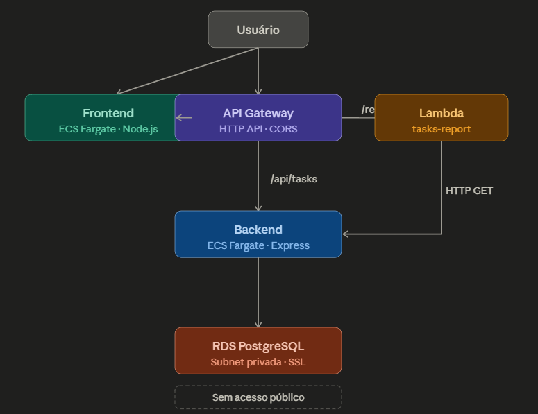

# Projeto Integrador - Cloud Developing 2025/1

> CRUD de Tarefas + API Gateway + Lambda /report + RDS + Front

**Grupo**:

1. 10435788 - Matheus Fernandes - Backend + RDS
2. 10438026 - Fernando Lacava - Infraestrutura AWS + Deploy
3. 10277893 - Joao Trevisol - Frontend + Lambda

## 1. Visao geral

Desenvolvemos um sistema de gerenciamento de Tarefas (Tasks) como dominio escolhido por sua simplicidade e clareza na demonstracao dos conceitos de computacao em nuvem. O CRUD permite criar, listar, atualizar e remover tarefas com campos de titulo, descricao, status (pendente/concluida) e prioridade (baixa/media/alta). A entidade foi escolhida por facilitar a demonstracao de estatisticas no endpoint /report via Lambda.

## 2. Arquitetura



| Camada | Servico | Descricao |
|--------|---------|-----------|
| Back-end | ECS Fargate | API REST Node.js + Express |
| Front-end | ECS Fargate | Node.js + Express (arquivos estaticos) |
| Banco | Amazon RDS | PostgreSQL 16 em subnet privada |
| Gateway | Amazon API Gateway | Rotas CRUD para ECS e /report para Lambda |
| Funcao | AWS Lambda | Consome a API e gera estatisticas JSON |

## 3. Como rodar localmente

```bash
cp backend/.env.example backend/.env   # configure variaveis
docker compose up --build
# API em http://localhost:3000
# Frontend em http://localhost:8080
```

## 4. Endpoints

| Metodo | Rota | Descricao |
|--------|------|-----------|
| GET | /api/tasks | Lista todas as tarefas |
| GET | /api/tasks/{id} | Busca uma tarefa |
| POST | /api/tasks | Cria nova tarefa |
| PUT | /api/tasks/{id} | Atualiza tarefa |
| DELETE | /api/tasks/{id} | Remove tarefa |
| GET | /report | Estatisticas via Lambda |

## 5. Deploy AWS

- Frontend: http://35.153.51.11
- API Gateway: https://m9aj7fdwvf.execute-api.us-east-1.amazonaws.com
- Repositorio: https://github.com/FernandoLacava/projeto2-servicos-nuvem